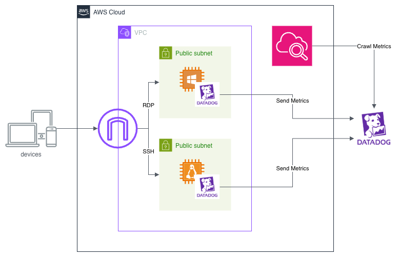

# AWS + Datadog Terraform Setup


> Automatically deploy Linux and Windows EC2 instances on AWS with the Datadog Agent pre-installed and the AWS–Datadog integration configured — all via a single `terraform apply`.



---

## Table of Contents

- [Introduction](#introduction)
- [Overview](#overview)
- [Prerequisites](#prerequisites)
- [Setup Instructions](#setup-instructions)
  - [1. Update terraform.tfvars](#1-update-terraformtfvars)
  - [2. Configure AWS Credentials](#2-configure-aws-credentials)
- [Deployment](#deployment)
- [Verification](#verification)
- [Notes](#notes)
- [Disclaimer](#disclaimer)

---

## Introduction

This repository provides a Terraform configuration that automatically deploys both **Linux** and **Windows** EC2 instances on **AWS**, with the **Datadog Agent** installed and the **AWS–Datadog integration** configured automatically.

The setup is ideal for sandbox testing or training environments where quick provisioning and Datadog integration are required.

---

## Overview

When you clone this repository and run `terraform apply`, the following actions occur automatically:

1. AWS EC2 instances (Linux and Windows) are launched.
2. The Datadog Agent is installed on each instance.
3. The Datadog AWS integration is configured.

---

## Prerequisites

Ensure the following tools are installed on your local machine before you begin:

| Tool | Installation Guide |
|------|--------------------|
| AWS CLI | [Install AWS CLI](https://docs.aws.amazon.com/cli/latest/userguide/getting-started-install.html) |
| Terraform | [Install Terraform](https://developer.hashicorp.com/terraform/install) |

---

## Setup Instructions

### 1. Update `terraform.tfvars`

Edit `terraform.tfvars` and fill in the following values:

| Variable | Description |
|----------|-------------|
| `creator` | Your name. |
| `your_global_ip_address` | Your global IP address. You can look it up [here](https://www.cman.jp/network/support/go_access.cgi). |
| `key_pair_name` | Name of a pre-created [EC2 key pair](https://docs.aws.amazon.com/AWSEC2/latest/UserGuide/create-key-pairs.html). |
| `dd_api_key` | Your Datadog API key. |
| `dd_app_key` | Your Datadog application key. |
| `dd_integration_role` | *(Datadog employees only)* Set according to the naming convention in [this internal guide](https://datadoghq.atlassian.net/wiki/spaces/TS/pages/346557463/AWS+Educational+Datadog+Sandbox+Account#Integrating-the-Sandbox). |

> **Security:** `dd_api_key` and `dd_app_key` are sensitive credentials. **Never commit them to version control.**

---

### 2. Configure AWS Credentials

Choose one of the following methods to authenticate with AWS:

- [IAM Identity Center (SSO)](https://docs.aws.amazon.com/cli/latest/userguide/cli-configure-sso.html#sso-configure-profile-token-auto-sso)
- [Environment variables](https://docs.aws.amazon.com/cli/latest/userguide/cli-configure-envvars.html?icmpid=docs_sso_user_portal)
- [Configuration and credential files](https://docs.aws.amazon.com/cli/latest/userguide/cli-configure-files.html)
- [Short-term credentials](https://docs.aws.amazon.com/cli/latest/userguide/cli-authentication-short-term.html)

---

## Deployment

Run the following commands from the project's root directory:

```bash
terraform init    # Run once during initial setup
terraform apply
```

Terraform will provision all AWS resources and automatically configure the Datadog integrations.

---
## Verification

After the deployment completes:

- Linux — Connect via SSH: AWS guide (https://docs.aws.amazon.com/AWSEC2/latest/UserGuide/connect-linux-inst-ssh.html)
- Windows — Connect via RDP: AWS guide (https://docs.aws.amazon.com/AWSEC2/latest/UserGuide/connect-rdp.html)

The Datadog Agent should be running and metrics should appear in your Datadog dashboard shortly after deployment.

---
## Notes

- All resources are deployed to your own AWS account. Verify that you have sufficient permissions and budget before applying.
- Review the Terraform plan output carefully before confirming to avoid unintended costs or misconfigurations.
- Datadog API and application keys are sensitive credentials — never commit them to version control.

---
## Disclaimer

This repository is intended for educational and testing purposes only.
Do not use it in production environments without reviewing and adapting the configuration for security, compliance, and cost-management requirements.
